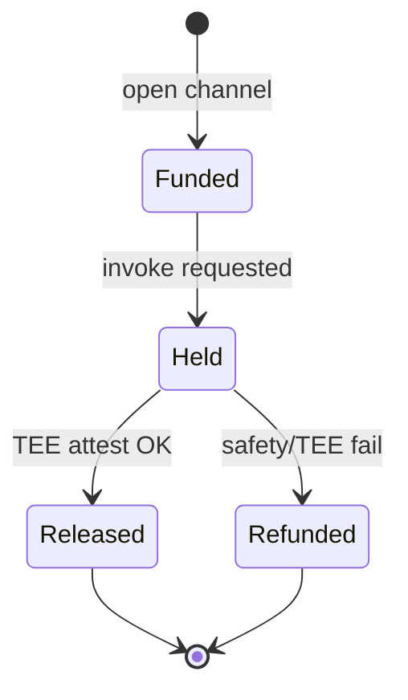

# TEE Escrow

**Product:** `aimarket-plugins` (hub plugin ecosystem)  
**Tagline:** *Smart-contract escrow inside a Trusted Execution Environment — both sides protected.*

## The problem

AI marketplaces usually charge **before** quality is proven:

- Buyer pays → provider may deliver garbage or leak data
- Provider ships → buyer may chargeback or dispute off-platform

Micropayment volume makes traditional escrow (humans, 30-day holds) impossible.

## Overview

**TEE Escrow** (via `aimarket-tee` + payment plugins) holds USDT in a channel until:

1. Invoke completes inside an attested enclave (or simulated attest in dev)
2. Provenance plugin signs a receipt
3. Safety plugin did not flag the session

If attestation fails → **automatic partial or full refund** on-channel — no support ticket.

| Party | Protection |
|-------|------------|
| **Buyer** | Funds not released without verify receipt |
| **Seller** | Payment guaranteed when attestation + invoke success |
| **Hub** | Non-custodial routing — plugins enforce policy |

## Plugin stack

| Plugin | Escrow role |
|--------|-------------|
| [`aimarket-tee`](../aimarket-tee/) | Attestation verify, enclave simulation hooks |
| [`aimarket-provenance`](../aimarket-provenance/) | Signed invoke receipts (W3C VC) |
| [`aimarket-safety`](../aimarket-safety/) | Pre-invoke hold / abort |
| [`aimarket-reputation`](../aimarket-reputation/) | Stake bonds for repeat sellers |

## Why plugins (not monolith)

Escrow rules **vary by vertical** (health, legal, finance). Plugins ship policy without redeploying hub core — enterprises enable TEE + provenance; dev sandboxes use simulated attest.

## Integration

Hub invoke pipeline calls plugins in order:

`safety → tee (pre) → route → tee (post) → provenance → settle`

See [`aimarket-tee/README.md`](../aimarket-tee/README.md) and [Protocol v2 escrow semantics](https://github.com/alexar76/aimarket-protocol/blob/main/spec.md).

See also: [../../docs/killer-features.md](../../docs/killer-features.md)
